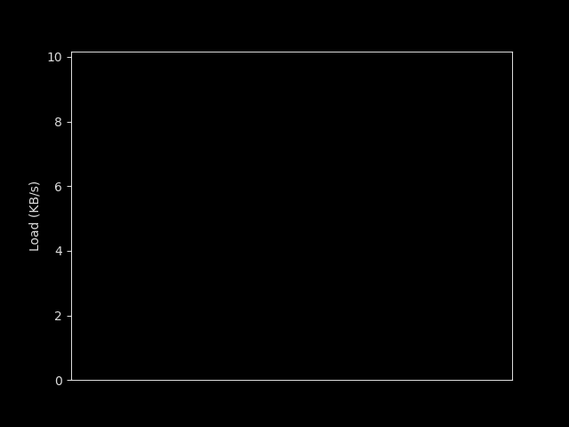

## Network Load: Down Speed Monitor Demo

This project was written to make the graphs on [this article](https://luizgfranca.github.io/blog/posts/002/) about techniques for the first computation of cumulative series. It consists of a Python script that gets the usage information from the operating system and creates a live graph representing it according with the different techniques that will be described in the article.

Example of a generated graph:




#### Requirements
 - Linux
 - Python 3
 - Matplotlib

### Instructions
#### Running

To execute the demonstration just run:

```sh
python main.py
```

#### Parameters

There are many parameters that can change the behavior of the execution, they are constants that can be changed in the `BEHAVIOR PARAMETERS` section of the code. They are:

##### INTERFACE_TO_MONITOR

Interface from which you want to monitor the load, to obtain the interfaces currently active on the device use: 

```sh
ip link show
```

Usually if you are connected to a Wi-Fi network the interface should start with `wlp`, if you are connecting via ethernet `enp` and if you are using a VPN `tun`.

##### selected_approach

Approach to calculate the first indicator data-point, they should be one if the items from the `Approach` enum, and are explained in detail in the article, so I will not detail them here.

##### MODE

Whether you want to save the graph to a `.gif` file (`SAVE_ANIMATION`) or to see it in real time (`LIVE_VIEW`).

##### FIXED_ADJUSTMENT_WINDOW

Makes the graph only adjust the top and bottom limits based on the maximum values they reached from the start of the run, instead on adjusting them dynamically to only fit the visible ones.

##### DEBUG_TICK

If you want to see the logs on every frame from the graph.
